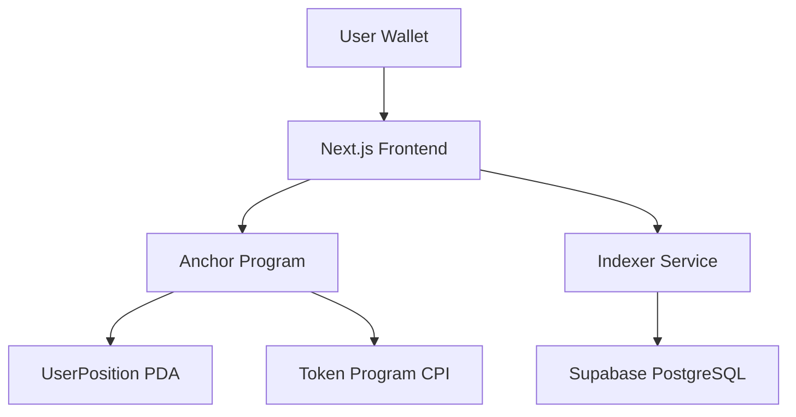

# 🌾 Harvester — Permissionless RWA Yield Harvester on Solana

**Register any tokenized asset • Accrue yield • Claim on-chain with one click.**

**Live Demo:** https://harvester-beta.vercel.app  
**Program ID (Devnet):** `AujdsDt1vs3RZ497KhoPxzKeRFghdEbjNKVqYSypEP1W`  
**Video Demo:** *Add your Loom link here*

---

## What Makes Harvester Unique

While protocols like Ondo Finance offer excellent single-asset tokenized Treasury products (USDY/OUSG) with automatic yield accrual, **Harvester** takes a different approach.

### Why Harvester?

- **Fully Permissionless** — Register any SPL token as an RWA position.
- **Explicit On-Chain Claims** — Users decide exactly when to harvest accrued yield.
- **Personal Multi-Asset Portfolio** — Manage multiple tokenized assets from one dashboard.
- **Built End-to-End** — Anchor smart contract, custom indexer, and modern frontend.

Harvester acts as your **personal on-chain RWA yield engine**.

---

## Features

- Register any SPL token mint as an RWA position
- Time-based yield accrual
- One-click on-chain yield claims
- Real-time portfolio dashboard
- Event-driven indexing
- Responsive wallet-connected UI
- Devnet deployed and fully functional

---

## How It Works

### User Flow

1. **Connect Wallet**
   - Phantom
   - Solflare
   - Backpack

2. **Register Position**
   - Enter an SPL token mint address
   - Specify an amount
   - Creates a `UserPosition` PDA

3. **Yield Accrues**
   - Yield is calculated based on elapsed time since the last claim

4. **Claim Yield**
   - Execute the `claim_yield` instruction
   - Tokens are transferred on-chain

5. **Portfolio Updates**
   - The indexer captures emitted events
   - Dashboard updates automatically

---

## On-Chain Logic

### `register_position`

Creates a PDA uniquely derived from:

- User wallet
- Token mint

Stores:

- Owner
- Mint
- Principal amount
- Last claim timestamp

### `claim_yield`

- Calculates accrued yield
- Transfers rewards through CPI to the Token Program
- Updates claim timestamp
- Emits claim events for indexing

---

## Tech Stack

| Layer | Technology | Notes |
|---------|-----------|---------|
| Program | Anchor (Rust) | PDAs, CPI, Events |
| Frontend | Next.js 15 + Tailwind CSS | Modern UI |
| Wallets | Solana Wallet Adapter | Phantom, Solflare, Backpack |
| Indexer | TypeScript | Event polling and processing |
| Database | Supabase (PostgreSQL) | Indexed portfolio storage |
| Network | Solana Devnet | Deployment environment |

---

## Architecture



---

## Quick Start

### 1. Clone Repository

```bash
git clone https://github.com/anmol0b/Harvester.git
cd Harvester
```

### 2. Program Setup

```bash
cd program

anchor build
anchor deploy --provider.cluster devnet
```

After deployment, update the frontend with the new Program ID if necessary.

### 3. Indexer Setup

```bash
cd ../indexer

npm install

cp .env.example .env
```

Add your Supabase credentials:

```env
SUPABASE_URL=YOUR_SUPABASE_URL
SUPABASE_ANON_KEY=YOUR_SUPABASE_KEY
```

Start the indexer:

```bash
npm run dev
```

### 4. Frontend Setup

```bash
cd ../frontend

npm install
npm run dev
```

Open:

```text
http://localhost:3000
```

---

## Demo Walkthrough

### Dashboard

View all registered positions and accumulated yield.

### Register Position

Create a new position using any SPL token mint.

### Claim Yield

Harvest accrued yield directly on-chain through a single transaction.

---

## Screenshots

### Dashboard


### Register Position


### Claim Yield


---

## Future Roadmap

### Performance

- Integrate Pinocchio zero-copy accounts
- Optimize yield calculation paths

### Real-Time Infrastructure

- Upgrade to Yellowstone gRPC streaming
- Replace polling-based indexing

### Oracle Integrations

- Integrate Pyth price feeds
- Dynamic yield rates

### Analytics

- Yield history tracking
- Portfolio performance charts
- Notifications and alerts

---

## Project Structure

```text
Harvester
├── frontend
│   ├── app
│   ├── components
│   └── hooks
│
├── program
│   ├── programs
│   └── tests
│
├── indexer
│   ├── src
│   └── database
│
└── README.md
```

---

## Development Status

- ✅ Smart Contract Deployed
- ✅ Frontend Live
- ✅ Indexer Operational
- ✅ Devnet Ready

---

## Built For

**Solana India Fellowship Capstone Project**  
May 2026

**Author:** Anmol Bhardwaj

- GitHub: https://github.com/anmol0b
- X (Twitter): https://x.com/anmol0b

---

## Questions or Feedback?

Feel free to:

- Open a GitHub issue
- Reach out on X (@anmol0b)
- Connect through the project repository

Contributions, feedback, and ideas are always welcome.